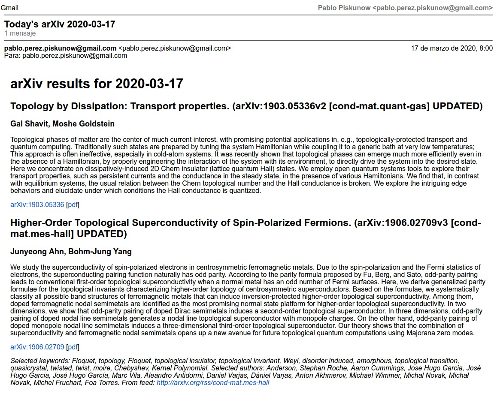

# arXiv feed checker and mailer


## How to use
### Setup arXiv feed checker with private variables
Edit the variables in `private_variables.py`.

Because your computer might not be on 24/7, I run this script multiple times per day (between 06:00 and 21:00 every hour). I do this by adding a cron job at my Raspberry Pi, by using `crontab -e` and then adding:
```
0 8-21/1 * * 1-5 /usr/bin/python /home/pi/arxiv-feed-mailer/send_arxiv.py >> /home/pi/arxiv-feed-mailer/send.log 2>&1
```

### Setup Google API
Step 1: Turn on the Gmail API

Click this button to create a new Cloud Platform project and automatically enable the Gmail API:

[Enable the Gmail API](https://developers.google.com/gmail/api/quickstart/python#step_1_turn_on_the)

In resulting dialog click DOWNLOAD CLIENT CONFIGURATION and save the file `credentials.json` to your working directory. 

1. Follow [step 1: Turn on the Gmail API](https://developers.google.com/gmail/api/quickstart/python#step_1_turn_on_the_api_name) to create a `client_secret.json` file.

2. Install the Google Client Library and other Python dependencies with:
  ```
  pip install --upgrade google-api-python-client google-auth-httplib2 google-auth-oauthlib
  ```

3. Run the code using the following command:
  ```
  python gmailsendapi.py
  ```
  (add the `--noauth_local_webserver` flag if you work through `ssh`)


  3.a The sample will attempt to open a new window or tab in your default browser. If this fails, copy the URL from the console and manually open it in your browser.

  3.b If you are not already logged into your Google account, you will be prompted to log in. If you are logged into multiple Google accounts, you will be asked to select one account to use for the authorization.

  3.c Click the Accept button.

  3.d The sample will proceed automatically, and you may close the window/tab.
  
4. Place credentials and configuration files in a folder
  There are a few files that contain the configuration and credentials, that can be placed in a different directory.
  By default, this directory is `~/Dropbox/arxiv/`, you can modify it in `gmailsendapi.py` and `send_arxiv.py`.
  The list of files that must be (plus [optionals]) in that folder are
  * `client_secret.json`
  * `credentials.json`
  * `token.pickle`
  * [`send.txt`]
  * [`private_variables.py`]

### Notes

* Authorization information is stored on the file system, so subsequent executions will not prompt for authorization.

## Example result
This is an entire screen capture of the e-mail:  


